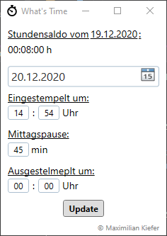

DigitalWorkingTimeAccount (also known as What's Time) is a tool which automatically creats a logfile in your documents folder, add a starttime to it and add's an endtime when you shutdown your PC or log off.
It is similar to a punch clock and allows you to keep track of your working times. You can also update and change times and your times.

